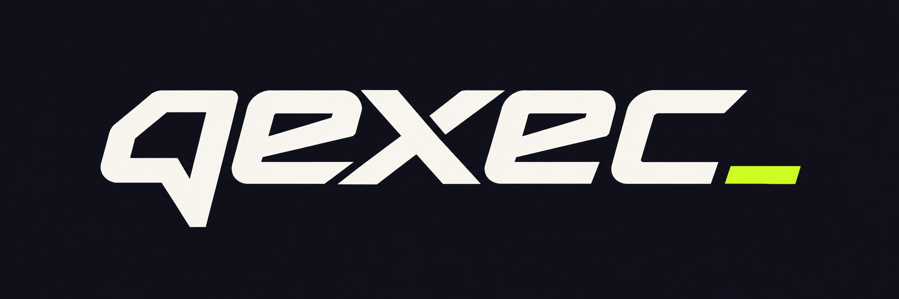

# qexec v0.1.0 — First Preview

The first public qexec preview brings the Quest Ledger interface and generated quest workflows to macOS. It builds on Skua and uses the selected qexec wordmark and `q_` app icon.

## Quest discovery and generation

- Detect accepted quests and generate a new C# script for one selected quest and reward. A matching farming script is optional; CoreBots remains a required shared library.
- Discover wiki sources from rewards and required items, with exact-name search as a fallback.
- Resolve multiple monster/map objectives, check documented variants, and verify item IDs and quantities before turn-in.
- Trace permanent materials through item → monster → map, including the Star Scrap Metal case where an ordinary inventory drop has no quest-only backlink.
- Recover material routes when quest search is unavailable; retry temporary source failures twice.
- Generate map-pickup steps and inspect the live map SWF with FFDec to discover a unique supported pickup ID. Collection objectives can use the documented quest location.
- Show research progress, support Cancel planning, and recheck the accepted quest before launch.

## Reliability and ownership

- Stop restores the game display and blocks late anti-lag commands from restoring the white screen.
- Temporary objectives avoid unnecessary bank loading.
- Bank loading retries and recognizes complete snapshots when an event was missed. Unknown contents remain unknown.
- Free quest drops/pickups can proceed with an explicit notice if the bank stays unavailable; purchases remain blocked. Known banked materials are retrieved rather than farmed again.
- Generic local KillQuest calls no longer incorrectly assign permanent materials to monsters.
- Includes the existing Mac script compilation/cache and CoreStory compatibility work from qexec development.

## Interface and tools

Quest Ledger, top navigation, activity log, Run/Stop controls, Vibe questing pixel effects, interface animations, reduced-motion support, player gear inspection, supported shop/farming plans, searchable progression catalog, and adaptive combat using available class profiles.

Logo 5 is now the qexec brand, including the macOS application icon.

## Download and setup

`qexec-v0.1.0-macos-apple-silicon.zip` contains `qexec.app`, setup instructions, and the scoped Flash trust helper. `SHA256SUMS.txt` records the archive checksum.

This build has a native Apple Silicon .NET host and an Intel renderer, so **Rosetta is required**. It also needs an existing **Artix Game Launcher** Flash plugin, a compatible external Skua script collection including **CoreBots**, and **Java/OpenJDK** for map-pickup inspection. The .NET runtime is bundled; an SDK is not required to run it.

The app is **ad-hoc signed and not notarized**. The proprietary Flash plugin, account data, personal scripts, and user settings are not included. See the included README and [Mac setup guide](../../Skua.App.Mac/MACOS.md).

## Validation and limits

Release checks cover backend build/tests, renderer/bridge lifecycle tests, generated C# compilation against an installed CoreBots collection, and a compiled/decompiled Flash pickup fixture. Regressions cover quest examples 10799, 1489, 4498 and the missing Star Scrap Metal objective from 9679. These are generation/compatibility checks, not proof of live server completion.

This is a preview. Arbitrary quest chains, dialogue puzzles, every wiki layout, and ambiguous map pickups remain unsupported. Class coverage depends on available profiles. Wiki changes, game access restrictions, and legacy runtime behavior can still block automation. The Electron/Flash renderer is legacy software, not a modern supported browser.

Thanks to the Skua, earlier RBot, and script community contributors. Existing notices are retained; qexec does not assert a replacement license over inherited code and is not an official Artix client.
