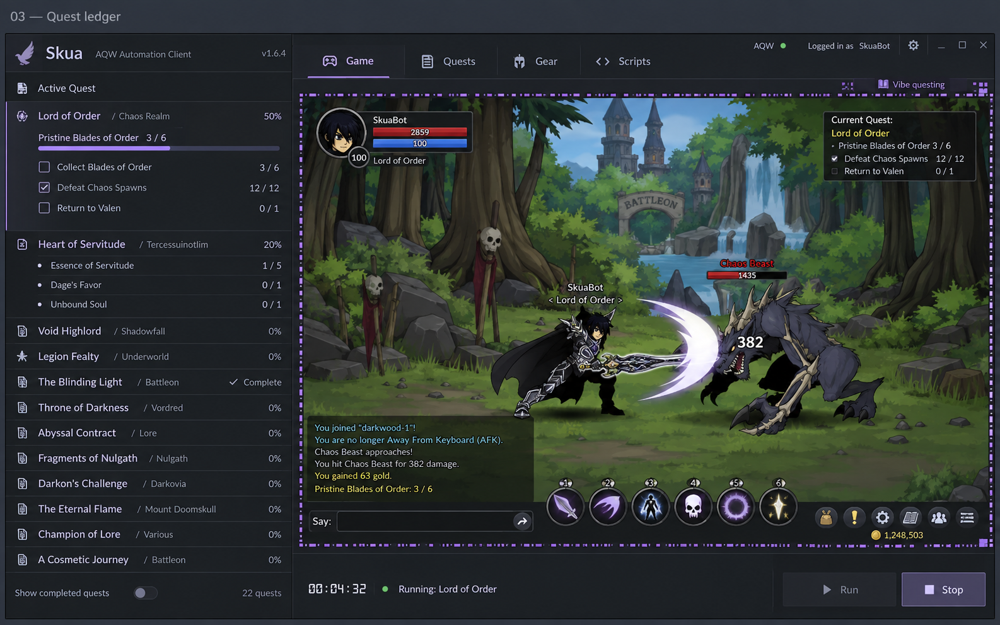
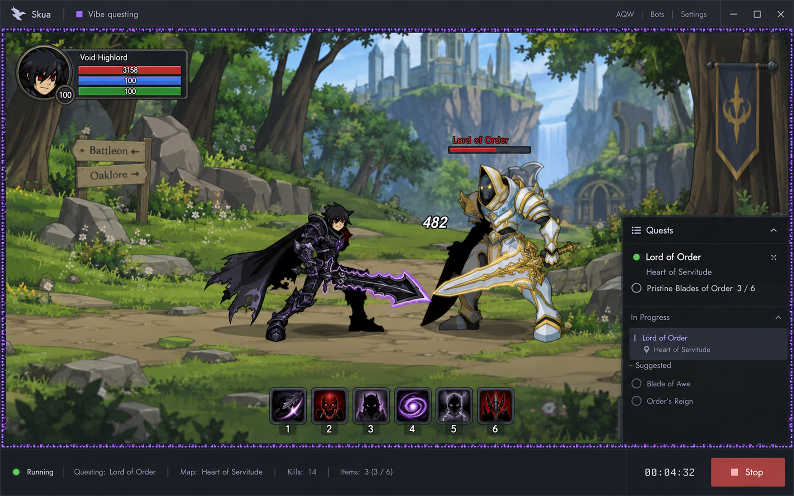

# qexec


**Inspect. Plan. Execute.** An experimental AQWorlds automation client built on Skua, with a macOS port and a quest-first interface.

The goal is to go beyond choosing a bot file: understand what your character needs, explain the route, generate the script, and recover when something goes wrong. This is active development, not a claim that every quest or item can already be automated.

[Roadmap](docs/ROADMAP.md) · [Build and setup](Skua.App.Mac/MACOS.md) · [Contributing](CONTRIBUTING.md) · [Upstream credits](docs/ATTRIBUTION.md)

[First release notes](docs/release-notes/v0.1.0.md) · [Quest generation details](Skua.App.Mac/QUEST-GENERATION.md)

## Quest Ledger



*AI-generated design reference selected for qexec. This is not an app screenshot; the game art and quest data are illustrative. The concept predates the qexec name. The current implementation uses a joined left quest ledger, top navigation, and game controls beneath the viewport.*

## What is implemented

- **Accepted quest detection:** reads live accepted quests and offers an Auto-do action.
- **Generated quest scripts:** discovers supported wiki sources, traces permanent materials and map pickups, creates a fresh C# script and attempts one quest turn-in. A matching farming bot is optional. Required reward choices stay explicit.
- **Inspect gear:** reads another player's equipped items, resolves names where possible, and looks for acquisition routes.
- **Shop and farming routes:** generates supported travel, shop, drop, and quest steps. A shop-opening route does not automatically purchase the item.
- **Ownership checks:** uses inventory and bank data where available; unavailable data remains unknown. Bank loading retries; free quest objectives can proceed with an explicit notice while purchases stay blocked.
- **Progression discovery:** builds a searchable catalog from available quest data and local scripts, alongside curated progression goals.
- **Adaptive combat:** selects saved class profiles with health thresholds and boss estimates. Coverage depends on the available profiles.
- **Vibe questing:** a click-through pixel effect while scripts run, plus subtle interface animations and reduced-motion support.

These features still need broader live-game validation. Unknown prerequisites, incomplete source information, bank failures, and complex quest chains can block automation. The client must show those limits instead of pretending a travel route is a completed farm.

## Where we're taking it

Our goal is to make qexec more reliable, understandable, and capable than the Skua workflow it grew from. We will measure that against reproducible tests and real quest outcomes.

| Priority | Outcome |
| --- | --- |
| Reliability first | Scripts start consistently, stop cleanly, and explain failures. |
| Complete acquisition plans | Resolve prerequisites, quest chains, merge materials, and the final reward. |
| Character-aware planning | Check inventory and bank, skip owned items, and recommend useful next upgrades. |
| Recoverable execution | Detect stalled objectives, retry within limits, and resume safely. |
| Better daily use | Show current objectives, progress, and actionable controls without covering the game. |

See the [full roadmap and completion criteria](docs/ROADMAP.md).

## Build and run

The current macOS build needs macOS, .NET 10 SDK, Node.js/npm, Java, and an existing Artix Game Launcher Flash plugin. Apple Silicon also needs Rosetta for the Intel renderer. The [v0.1.0 preview release](https://github.com/Crimson341/qexec/releases/tag/v0.1.0) includes an Apple Silicon Mac app download and setup instructions. It is ad-hoc signed, not notarized.

```sh
git clone https://github.com/Crimson341/qexec.git
cd qexec/Skua.App.Mac
./build-macos.sh
```

Follow [MACOS.md](Skua.App.Mac/MACOS.md) for Flash trust setup, scripts, runtime paths, and environment overrides before launching. The app bundle is named `qexec.app`. The settings directory and compatibility namespaces retain `Skua Mac` / `Skua.*` to preserve existing scripts and settings. The legacy renderer is not a modern supported browser.

Quest automation requires a compatible external Skua script collection, including CoreBots. Personal scripts, account settings, bank data, cached assemblies, and the proprietary Flash plugin are not included. See the [compatibility notes](Skua.App.Mac/compat/README.md).

## Verification

```sh
cd Skua.App.Mac
dotnet build host -c Release -p:SkuaPortable=true
npm ci --prefix desktop --arch=x64
npm test --prefix desktop
dotnet run --project tests/BridgeTests.csproj -p:SkuaPortable=true
```

Tests cover the script/bridge lifecycle, included source resolution, quest preloading, renderer state, and generation logic. Passing them is not proof that every live quest is supported.

## Longer-term direction



*An alternate AI-generated concept for a future optional compact mode. The Quest Ledger remains the selected primary layout.*

## Credits and licensing

qexec is derived from [Skua](https://github.com/auqw/Skua), including the work of [BrenoHenrike](https://github.com/BrenoHenrike/Skua), the maintained Skua contributors, and the earlier RBot project. Git history and existing third-party notices are retained. AQWorlds and its game assets belong to their respective owners; qexec is not an official Artix client.

No replacement license is asserted over upstream code. See [attribution and licensing status](docs/ATTRIBUTION.md).
